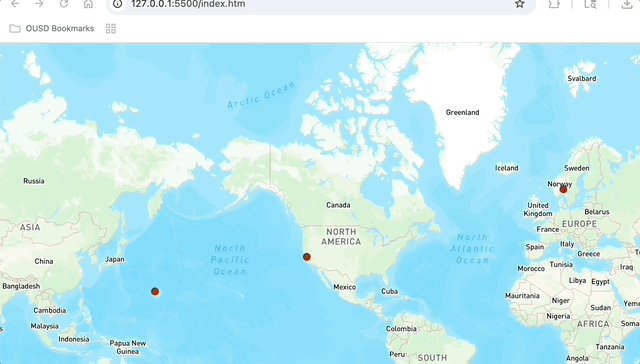

# My Favorite Places Map

## What did I build?

[My Favorite Places Map](https://avvv3.github.io/my-first-map/) is a little site that shows some of my favorite places in the world that I have traveled to. These places include a small starbucks near in my hometown, a cruise that I went of awhile ago, and the country that I want to live in once I have finished all of my education.

Heres My Demo:

### Code Spotlight
I believe that my code spotlight is my GIF, it took me awhule to get the hang of what was going on but I was eventually able to figure it out in the end.

## Technology

To build this app, I used the following tools:

1. [Google Maps](https://www.google.com/maps).
2. [Mapbox GL JS](https://docs.mapbox.com/mapbox-gl-js/guides) library, for styling and displaying maps and route lines, and adding camera behaviors (flyto animations).
3. [Visual Studio Code](https://code.visualstudio.com/download) free IDE, with [Live Server](https://marketplace.visualstudio.com/items?itemName=ritwickdey.LiveServer) and [Markdown All in One](https://marketplace.visualstudio.com/items?itemName=yzhang.markdown-all-in-one) extensions.
4. [GitHub pages](https://docs.github.com/en/pages/getting-started-with-github-pages/creating-a-github-pages-site), for publishing the app for free!
